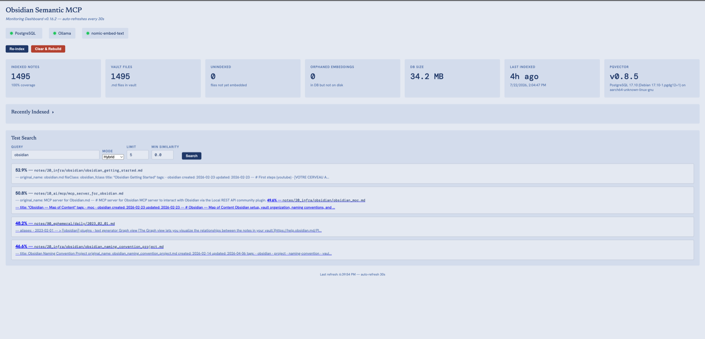

# Obsidian Semantic MCP

[](https://github.com/artificemachine/obsidian-semantic-mcp/actions/workflows/tests.yml)
[](LICENSE)
[](pyproject.toml)
[](https://hub.docker.com/r/newblacc/obsidian-semantic-mcp)

A persistent memory layer for Claude Desktop — semantic search across your entire Obsidian vault using local embeddings and PostgreSQL + pgvector.



## The Problem

AI assistants forget everything between sessions. You repeat context, lose continuity, and start from zero every time. Your notes, projects, and preferences sit in Obsidian but never make it into your AI conversations automatically.

## The Solution

**Obsidian Semantic MCP** turns your vault into a queryable brain for Claude. It:

- Indexes every note as a vector embedding (via Ollama + `nomic-embed-text`)
- Stores embeddings in PostgreSQL with pgvector for fast semantic search
- Watches your vault for changes and re-indexes automatically
- Provides full vault CRUD (read, write, search, list) — works even when Obsidian is closed
- Exposes everything through MCP so Claude can retrieve and manage vault content on the fly

No cloud services. No API keys. Everything runs locally.

## Quick Start

Start with the bootstrap installer for your platform. If you already cloned the repo, you can skip bootstrap and run `uv run osm init` from the project root.

### First 60 seconds (new user)

If you're in a fresh environment (no `osm` launcher yet), run these from the repo root.

**Pick the mode number for your OS** — the recommended path is Full Docker (everything in containers, nothing to install but Docker):

| OS | Recommended `--mode` |
|----|----------------------|
| macOS | `--mode 3` |
| Linux / Windows | `--mode 2` |

```bash
# 1) Preview setup actions safely — no changes made (use YOUR mode from the table)
uv run osm init --dry-run --mode 3 --vault "/path/to/your/vault" --pg-password "obsidian" --persistent --data-dir "/path/to/data"

# 2) Run setup for real
uv run osm init --mode 3 --vault "/path/to/your/vault" --pg-password "obsidian" --persistent --data-dir "/path/to/data"

# 3) Open the monitoring dashboard
uv run osm dashboard
```

> The commands above use `--mode 3` (macOS). On Linux/Windows use `--mode 2`.
> Already running Ollama locally? Use `--mode 4` (Docker + host Ollama) to skip re-downloading the Ollama image and model.
> `--mode 1` is a **native** (non-Docker) macOS install — only pick it if you specifically want Postgres and the server running outside containers.
> For ephemeral/CI setups, use `--no-persistent` instead.

> **Platform support:** Linux is the CI-tested path — the full test suite (including PostgreSQL integration tests) runs on `ubuntu-latest` in CI on every push. macOS is supported via `osm init --mode 3` (Docker Desktop on the recommended path, or `osm init --mode 1` native) but is not yet covered by CI. Windows is supported via the WSL2 Docker backend and the `install.ps1` / `osm.ps1` launchers, but is **not yet covered by CI**; treat it as community-tested until a Windows runner lands.

**Before you start:**
- **`uv`** must be installed — `curl -LsSf https://astral.sh/uv/install.sh | sh` (macOS/Linux) or `powershell -c "irm https://astral.sh/uv/install.ps1 | iex"` (Windows)
- **Docker Desktop** — the wizard will offer to install it automatically if missing (`brew` on macOS, `winget` on Windows, `get.docker.com` on Linux). On Windows, enable the WSL2 backend.
- Know your vault path — in Obsidian: Settings → About → Vault location

### 1. Bootstrap and run the setup wizard

**macOS / Linux:**
```bash
curl -fsSL https://raw.githubusercontent.com/artificemachine/obsidian-semantic-mcp/main/install.sh | bash
```

> If `~/.local/share/obsidian-semantic-mcp` already exists, the installer updates that checkout before continuing. If that install directory has uncommitted local changes, the update step can abort with a Git merge error. In that case either commit/stash those changes there, or use your current checkout directly with `uv run osm init`.

**Windows PowerShell:**
```powershell
powershell -c "irm https://raw.githubusercontent.com/artificemachine/obsidian-semantic-mcp/main/install.ps1 | iex"
```

> **Tip:** The bootstrap installer launches `osm init` for you. After a full install, you can run `osm init --dry-run` from an existing checkout to preview every action without making any changes.
>
> If you already cloned the repo, `scripts/osm` (macOS/Linux) and `scripts/osm.ps1` (Windows PowerShell) work the same as the bootstrap installers.
> If you prefer a manual checkout, clone the repo and run `uv run osm init` from the project root.
>
> **One server, all projects:** `obsidian-semantic` is registered globally — running `osm init` from any other project is safe and idempotent. If already configured, it skips registration and informs you.
>
> **OpenCode/GitHub Copilot note:** In this repository, `osm` means the **Obsidian Semantic MCP CLI**, not OpenStreetMap. In a new chat session, run commands explicitly (for example, `osm dashboard`) to avoid acronym ambiguity.
>
> **If `osm` is not found:** use `uv run osm <command>` from the repo root (for example, `uv run osm init --dry-run`).
>
> **Session starter (copy/paste):**
> ```text
> In this repo, "osm" means the obsidian-semantic-mcp CLI (not OpenStreetMap).
> Please execute shell commands directly when I type them.
> If `osm` is not found, use `uv run osm ...` from the repo root.
> Examples: osm init, osm dashboard.
> ```
>
> **Exit the wizard at any prompt:** type `q`, `quit`, `exit`, or `skip` — or press `Ctrl+C`.

The bootstrap installers clone into the local data directory, create a PATH shim for `osm`, and launch the wizard.

The wizard detects your OS and asks which installation mode you want:

**macOS:**
```
  1)  Native              Homebrew + local Postgres + local Ollama
  2)  Docker + host Ollama    Postgres in Docker, Ollama already on this Mac
  3)  Full Docker         Everything in containers  (recommended)
  4)  Docker + remote Ollama  Postgres in Docker, Ollama on another machine
```

**Linux:**
```
  1)  Docker + host Ollama    Postgres in Docker, Ollama on this machine
  2)  Full Docker         Everything in containers  (recommended)
  3)  Docker + remote Ollama  Postgres in Docker, Ollama on another machine
```

**Windows (requires Docker Desktop with WSL2 backend):**
```
  1)  Docker + host Ollama    Postgres in Docker, Ollama already on this PC
  2)  Full Docker         Everything in containers  (recommended)
  3)  Docker + remote Ollama  Postgres in Docker, Ollama on another machine
```

> **Which mode?** Pick **Full Docker** (mode 3 on macOS, mode 2 on Linux/Windows) unless you already have Ollama running locally - in that case pick **Docker + host Ollama** to avoid re-downloading the Ollama image and model.

It then:
- Sets up the local install directory and PATH shim
- Installs prerequisites or verifies they already exist (Docker is installed and started automatically if missing)
- Pulls `nomic-embed-text` if needed
- Writes a `.env` file (gitignored) with your vault path and credentials
- Updates MCP client config automatically for **Claude Desktop**, **Claude Code CLI**, **OpenCode**, and **pi** (whichever are installed)
- Uses the repo launcher script in generated MCP entries, so startup does not depend on a raw Docker command or container-name-specific config

### 2. Restart your MCP client(s)

Restart Claude Desktop / OpenCode to pick up the new server. For Claude Code CLI, the entry is registered live; verify with `claude mcp list`. For pi, run `/reload` inside an active session or restart pi.

> **pi users:** `osm init` also patches `~/.pi/agent/extensions/mcp-bridge.ts` if
> present. obsidian-semantic requires `heartbeat: true` and a spawn-time heartbeat
> in the bridge due to its blocking asyncio stdin transport. See
> [`docs/pi_mcp_bridge_heartbeat.md`](docs/pi_mcp_bridge_heartbeat.md) for details.

> **Manual config (only if `osm init` could not detect your client)**
>
> Add the same block to `~/.opencode.json`, `claude_desktop_config.json`, or whatever JSON config your MCP client uses:
> ```json
> {
>   "mcpServers": {
>     "obsidian-semantic": {
>       "command": "/absolute/path/to/obsidian-semantic-mcp/scripts/obsidian-semantic-mcp",
>       "args": [],
>       "env": {}
>     }
>   }
> }
> ```
> Replace `/absolute/path/to/obsidian-semantic-mcp` with your local clone path. The launcher prefers the running Docker stack and falls back to the repo-local `.venv` when Docker is unavailable.

### 3. First-run indexing

The server indexes your vault on first run, then watches for changes automatically.

> **First-run indexing takes roughly 1–2 seconds per note** — expect 5–15 minutes for a 500-note vault. Monitor progress at http://localhost:8484. Claude will return no results until indexing completes.

> Prefer running without Docker? See [Native Install (macOS)](#native-install-macos).
> Want to skip the wizard? See [Manual start](#manual-start-without-wizard).

---

### Native Install (macOS)

Prefer not to run Docker? `osm init --mode 1` installs PostgreSQL + pgvector and Ollama via Homebrew and runs the MCP server in-process — no containers. Pick this if you already avoid Docker, or want the server sharing your Mac's native Ollama install directly.

```bash
uv run osm init --mode 1 --vault "/path/to/your/vault"
```

This mode registers the MCP client entry with `OBSIDIAN_VAULT`/`DATABASE_URL` set directly on the entry (Docker mode instead loads a `.env` the launcher finds via the running container's project root) — restart your MCP client afterward the same as any other mode.

### Manual start (without wizard)

```bash
OBSIDIAN_VAULT="/path/to/your/vault" POSTGRES_PASSWORD=obsidian docker compose up -d
```

> Docker Compose also reads a `.env` file in the repo root (gitignored).

First run pulls all images and the `nomic-embed-text` model automatically. This starts:

| Service | Port | Description |
|---------|------|-------------|
| PostgreSQL + pgvector | 5433 | Vector storage (avoids conflict with host pg) |
| Ollama | 11435 | Local embeddings (auto-pulls model) |
| MCP server | stdio | Clients connect via `scripts/obsidian-semantic-mcp`, which prefers Docker and falls back to local `.venv` |
| Dashboard | 8484 | http://localhost:8484 |

### Useful commands

```bash
# View server logs
docker compose logs -f mcp-server

# Rebuild after code changes
docker compose up -d --build mcp-server dashboard

# Stop everything
docker compose down

# Stop and wipe all data (re-index from scratch)
# ⚠️  WARNING: -v deletes all indexed embeddings. Re-indexing will restart from scratch.
docker compose down -v
```

### GPU support (optional)

For faster embeddings on Linux with NVIDIA GPU, add to the `ollama` service in `docker-compose.yml`:

```yaml
deploy:
  resources:
    reservations:
      devices:
        - capabilities: [gpu]
```

### Troubleshoot

The top 3 things that go wrong on first install:

- **No search results / Claude says the server isn't connected** — first-run indexing takes 5–15 minutes for a 500-note vault; watch progress at http://localhost:8484, or `docker compose logs -f mcp-server`.
- **Postgres connection failures** — check the container is healthy: `docker compose ps`, then `docker compose exec postgres pg_isready -U obsidian`.
- **Ollama unreachable** — confirm it's running: `curl http://localhost:11434/api/tags` (or the SSH tunnel's local port for remote-Ollama mode).

Full incident-by-incident guide, including dashboard/indexing/Ollama-container recovery steps: [`docs/RUNBOOK.md`](docs/RUNBOOK.md).

---

## Using with Claude

Once the MCP server is connected, Claude can access your vault directly — no special syntax needed. Just talk to it naturally.

### Example prompts

```
"Search my notes for anything about project X"
"What did I write about ketosis last month?"
"Find my notes on the Zettelkasten method"
"Read my Daily/2026-03-14.md note"
"Append this meeting summary to my inbox note"
"Write a new note at Projects/obsidian-mcp.md with this content"
"List all files in my Fleeting folder"
"Show me what's been modified recently"
"Re-index my vault"
```

Claude will automatically choose the right MCP tool (`search_vault`, `get_file`, `write_file`, etc.) based on your request.

### osm — Setup & management CLI

Use `osm` to set up, manage, and tear down the stack. The wizard installs all prerequisites, configures Docker, and updates Claude Desktop automatically.

`osm` in this repo means the Obsidian Semantic MCP CLI (not OpenStreetMap).

| Command | Description |
|---------|-------------|
| `osm init` | Interactive setup wizard |
| `osm init --mode <1-4> --vault <path>` | Non-interactive setup (agent/script friendly) |
| `osm init --dry-run` | Preview all actions without making any changes |
| `osm status` | Check service health (Docker, Ollama reachability/inference, Claude Desktop) |
| `osm vaults` | List configured Obsidian vault(s) |
| `osm dashboard` | Open monitoring dashboard in browser |
| `osm rebuild` | Rebuild Docker images after a code change |
| `osm tunnel` | Reconnect SSH tunnel (remote Ollama mode) |
| `osm remove` | Stop services and wipe all volumes and config |
| `osm remove --yes` | Non-interactive teardown (agent/script friendly) |
| `osm help` | Full flag reference |

**`osm init` flags:** `--mode`, `--vault`, `--pg-password`, `--persistent` / `--no-persistent`, `--data-dir`, `--ssh-host`, `--ssh-user`, `--ssh-port`, `--ssh-key`, `--vault-remote`

`osm status` probes both Ollama reachability (`/api/tags`) and embeddings (`/api/embeddings`) so it can catch the case where the daemon is up but model execution is broken.

> **Windows launcher:** `osm init` installs `osm.cmd` into `%USERPROFILE%\.local\bin\`. Windows resolves `.cmd` automatically, so you invoke it as `osm` from any terminal. If `osm` is not found, add `%USERPROFILE%\.local\bin` to your `Path` environment variable.

### Using with Claude Code, Codex, and OpenCode

When you type `osm init` or `osm dashboard` directly in your terminal, those commands execute normally.

In chat-based coding agents, a bare `osm ...` message can be interpreted as text (or as OpenStreetMap) instead of a shell command. To force execution, phrase it explicitly:

- `Run osm init`
- `Run osm dashboard`

If the launcher is not installed yet (or not on PATH), use:

- `Run uv run osm init --dry-run --mode 1 --vault <vault-path> --pg-password <password>`
- `Run uv run osm dashboard`

What to expect for new users:

- First install: `osm init` sets up services and registers `obsidian-semantic` in global MCP config for that OS user.
- Later sessions: re-running `osm init` is safe and idempotent.
- `osm dashboard` opens `http://localhost:8484`; if the stack is not running yet, it warns and still opens the URL.

**Session starter (copy/paste):**

```text
In this repo, "osm" means the obsidian-semantic-mcp CLI (not OpenStreetMap).
Please execute shell commands directly when I type them.
If `osm` is not found, use `uv run osm ...` from the repo root.
Examples: osm init, osm dashboard.
```

### Example Output

When Claude searches your vault, results come back ranked with similarity scores and content previews:

```
## Search: "what did I write about ketosis"

1. health/ketosis-diet.md (similarity: 0.87)
   Ketosis is a metabolic state where the body burns fat for fuel...
   
2. Daily/2026-03-14.md (similarity: 0.72)
   Started keto today. Meal prepped for the week...
   
3. research/low-carb-studies.md (similarity: 0.65)
   Recent studies on low-carb diets show...
```

For vault CRUD, `get_file` returns the full note content; `recent_changes` lists recently modified files with timestamps.

## Architecture

```
Claude Desktop
    ↓ MCP protocol (stdio)
src/server.py (unified MCP server)
    ├── Semantic search (pgvector cosine similarity)
    ├── Vault CRUD (direct filesystem access)
    └── Live file watcher (watchdog)
    ↓
PostgreSQL + pgvector (vector storage + IVFFlat index)
    ↓
Ollama / nomic-embed-text (local 768-dim embeddings)
    ↓
Your Obsidian vault (e.g. $HOME/Documents/MyVault)
```

## Project Structure

```
obsidian-semantic-mcp/
├── install.sh          # Bootstrap installer for macOS/Linux
├── install.ps1         # Bootstrap installer for Windows PowerShell
├── scripts/
│   ├── osm                # CLI wrapper (macOS/Linux) — `uv run osm init` or `scripts/osm init`
│   └── osm.ps1            # CLI wrapper (Windows) — `.\scripts\osm.ps1 init`
├── src/
│   ├── server.py          # MCP server — semantic search + vault CRUD (11 tools)
│   └── dashboard.py       # Monitoring dashboard (http://localhost:8484)
├── tests/
│   ├── test_unit.py            # Unit tests (no real DB/Ollama needed)
│   ├── test_osm_init.py        # Unit tests for the osm CLI wizard
│   ├── test_dashboard_smoke.py # Dashboard static analysis + live HTTP smoke tests
│   ├── test_setup.py           # Prerequisites checker (deps, DB, Ollama) — run directly
│   └── test_e2e.py             # End-to-end MCP protocol test — run directly
├── osm_init.py            # Interactive setup wizard (used by scripts/osm)
├── Dockerfile             # Python 3.13 + uv
├── docker-compose.yml     # Full stack: postgres, ollama, server, dashboard
├── pyproject.toml         # Project metadata + dependencies (osm script entry)
├── uv.lock                # Pinned lockfile
└── LICENSE                # Apache 2.0
```

## Prerequisites

- An Obsidian vault on your filesystem
- **macOS native:** Homebrew (auto-installs everything else)
- **Docker modes:** Docker Desktop (macOS/Linux/Windows) — the wizard offers to install it if missing via `brew` (macOS), `winget` (Windows), or `get.docker.com` (Linux), and starts the daemon automatically
- **Windows:** WSL2 backend enabled, `uv` installed via `powershell -c "irm https://astral.sh/uv/install.ps1 | iex"`

## MCP Tools

### Semantic Search

| Tool | Description |
|------|-------------|
| `search_vault` | Semantic search by meaning across the entire vault. Returns ranked excerpts with similarity scores. Supports `graph_expand: true` to follow wikilinks from top results and surface connected notes that didn't rank semantically. |
| `simple_search` | Exact text/keyword search across vault files. |
| `get_note_connections` | Return all notes connected to a given note via wikilinks — both outgoing links and incoming backlinks. Useful for exploring the knowledge graph and finding related notes. |

### Vault Management

| Tool | Description |
|------|-------------|
| `list_files` | List files and directories in a vault directory. |
| `get_file` | Read the full content of a single file. |
| `get_files_batch` | Read multiple files at once. |
| `append_content` | Append content to a file (creates if missing). |
| `write_file` | **Overwrites** the target file completely — existing content is replaced with no undo. Use `append_content` if you want to add to an existing file instead. |
| `recent_changes` | Get recently modified files. |

### Index Management

| Tool | Description |
|------|-------------|
| `list_indexed_notes` | List all indexed notes with their last indexed timestamp. |
| `reindex_vault` | Force a full re-index of all notes. Runs in the background. |

## Multi-Vault Support

To index multiple vaults, set `OBSIDIAN_VAULTS` to a comma-separated list of absolute paths:

```bash
OBSIDIAN_VAULTS="/path/to/vault1,/path/to/vault2" docker compose up -d
```

Or in docker-compose.yml (uncomment the multi-vault lines):

```yaml
environment:
  OBSIDIAN_VAULTS: /vault1,/vault2   # multi-vault
volumes:
  - /path/to/vault1:/vault1
  - /path/to/vault2:/vault2
```

When using multiple vaults, the `search_vault` MCP tool gains a `vault` parameter to filter results by vault name. The dashboard also shows a vault selector. Each vault is watched and indexed independently.

## How It Works

1. **Indexing** — On startup, the server walks your vault, reads each `.md` file, generates a 768-dim embedding via Ollama, and upserts it into PostgreSQL with pgvector. Unchanged files (same SHA-256 hash) are skipped on subsequent runs. **First-run indexing takes roughly 1–2 seconds per note** with a local Ollama instance — expect 5–15 minutes for a 500-note vault. Watch progress at http://localhost:8484 or via `docker compose logs -f mcp-server`.
2. **Watching** — A file watcher (`watchdog`) monitors the vault for creates, updates, deletes, and moves — re-embedding changed files automatically.
3. **Searching** — When Claude calls `search_vault`, the query is embedded and matched against stored vectors using cosine similarity (IVFFlat index). The top results are returned with similarity scores and content previews.
4. **CRUD** — All file operations use direct filesystem access, so the server works whether Obsidian is open or not. Path traversal outside the vault is blocked.

## Environment Variables

| Variable | Description | Default |
|----------|-------------|---------|
| `OBSIDIAN_VAULT` | Absolute path to your Obsidian vault. Mounted **read-write** so MCP write/append tools can create and update notes. Mount with `:ro` if you only need search. | *required* |
| `OBSIDIAN_VAULTS` | Comma-separated list of vault paths for multi-vault mode. Overrides `OBSIDIAN_VAULT` when set. | — |
| `OBSIDIAN_IGNORE_PATHS` | Comma-separated vault-relative path segments to skip during indexing and watching. Defaults to `archive`; set it to an empty string to index archived notes. | `archive` |
| `POSTGRES_PASSWORD` | PostgreSQL password (Docker) | *required for Docker* |
| `DATABASE_URL` | Full connection string (overrides POSTGRES_* vars) | built from POSTGRES_* vars |
| `POSTGRES_HOST` | PostgreSQL host | `localhost` |
| `POSTGRES_PORT` | PostgreSQL port | `5432` |
| `POSTGRES_DB` | Database name | `obsidian_brain` |
| `POSTGRES_USER` | Database user | `obsidian` |
| `OLLAMA_URL` | Ollama API endpoint | `http://localhost:11434` |
| `EMBEDDING_MODEL` | Ollama model for embeddings | `nomic-embed-text` |
| `EMBED_WORKERS` | Parallel threads for bulk indexing | `4` |
| `RERANK_MODEL` | Optional Ollama model for cross-encoder re-ranking (e.g. `llama3.2`). Disabled when empty. | — |
| `RERANK_CANDIDATES` | Candidate pool size fetched before re-ranking | `20` |
| `DASHBOARD_BIND` | Interface the monitoring dashboard binds to. Loopback by default; set `0.0.0.0` only for a native install reachable from another host. | `127.0.0.1` |
| `DASHBOARD_TOKEN` | Bearer token for the dashboard's mutating endpoints. Generated and stored at `~/.config/obsidian-semantic-mcp/dashboard_token` (mode `0600`) if unset. | *auto-generated* |
| `OSM_SKIP_PI` | Set to `1` to skip configuring the optional `pi` MCP client during `osm init`, even if the `pi` binary is installed. Useful for a clean setup matching what most users (no `pi`) see. | — |

## Monitoring Dashboard

A built-in dashboard is available at http://localhost:8484 (started automatically with Docker). It shows:

- Service health (PostgreSQL, Ollama, embedding model)
- Indexed notes count, vault coverage, DB size
- Recently indexed files (collapsible — click the heading to hide/show)
- **Re-index** — incremental re-index (skips unchanged notes, fast)
- **Clear & Rebuild** — wipes all embeddings and re-indexes from scratch
- A "Start Ollama" button if Ollama is down

To run the dashboard without Docker:

```bash
OBSIDIAN_VAULT="/path/to/your/vault" uv run python3 src/dashboard.py
```

## Testing

### Unit tests (no real DB or Ollama needed)

```bash
uv run pytest -q
```

Runs 400+ tests (see CI logs for the exact count — the Tests badge above shows pass/fail status, not a number). Most run without a database. A set of PostgreSQL integration tests are gated behind a `pg` marker and run in CI against a pgvector service. Coverage spans embedding, search, vault path safety, connection pool, dashboard auth, cross-process locking, schema migrations, the osm CLI wizard, and CI governance.

### `test_dashboard_smoke.py` — Dashboard health checks (Docker stack)

Offline static analysis (always runs — no services needed) + live HTTP smoke tests (auto-skipped when the dashboard is unreachable).

```bash
# Offline + live (stack must be running)
uv run pytest tests/test_dashboard_smoke.py -v

# Target a remote instance
DASHBOARD_URL=http://host:8484 uv run pytest tests/test_dashboard_smoke.py -v
```

Checks: JS string safety, DOM element completeness, `/api/stats` schema, service health, response time, and routing.

### `test_setup.py` — Prerequisites check (native installs)

Verifies Python deps, vault path, PostgreSQL + pgvector, Ollama, and embedding smoke test. Run directly — not via pytest.

```bash
DATABASE_URL="postgresql://localhost/obsidian_brain" \
OBSIDIAN_VAULT="/path/to/your/vault" \
uv run python3 tests/test_setup.py
```

### `test_e2e.py` — End-to-end MCP test (native installs)

Launches the server, initializes MCP protocol, waits for indexing, runs semantic search, and verifies results. Run directly — not via pytest.

Requires `DATABASE_URL` **or** `POSTGRES_PASSWORD` — the server will exit immediately without one.

```bash
DATABASE_URL="postgresql://localhost/obsidian_brain" \
OBSIDIAN_VAULT="/path/to/your/vault" \
uv run python3 tests/test_e2e.py
```

## Windows + network vault (NFS / SMB)

If your vault lives on a NAS and is mounted on Windows as a drive letter (`Z:\`), `osm init` will fail to bind-mount it into the container — Docker Desktop on Windows uses WSL2, and WSL2 cannot follow a Windows-side network drive into a container. The UNC form (`\\host\share\...`) is rejected by the daemon outright; the drive-letter form silently mounts an empty directory.

**Recommended fix: mount the share inside WSL2 and point `osm init` at the Linux path.**

```bash
# inside your WSL2 distro (Ubuntu/Debian)
sudo apt install nfs-common
sudo mkdir -p /mnt/obsidian_vault
sudo mount -t nfs <nas-host>:/<export-path> /mnt/obsidian_vault
# add to /etc/fstab to persist across reboots

osm init --mode 2 --vault /mnt/obsidian_vault
```

Docker Desktop shares WSL2 paths cleanly with no volume-driver gymnastics. Starting in v0.5.11, `osm init` also fails fast when `docker compose up` is rejected and points you at this section instead of letting the postgres health check time out 90 seconds later.

### Alternative: native NFS / CIFS named volumes (`--vault-fs`, v0.5.12+)

If WSL2 isn't an option, `osm init` can generate a `docker-compose.override.yml` that backs each vault with a Docker named volume using NFS or CIFS driver_opts. Vault entries use protocol-specific syntax instead of host paths:

```bash
# NFS (one or more vaults; entries use host:/export/path)
osm init --mode 3 \
  --vault 10.0.0.1:/exports/coredev \
  --vault-fs nfs

# CIFS / SMB
osm init --mode 3 \
  --vault //nas.local/share/coredev \
  --vault-fs cifs \
  --vault-cifs-user alice --vault-cifs-pass 'secret'
```

For multi-vault, pass each entry to a comma-joined `OBSIDIAN_VAULTS` env (or repeat `--vault`); each generates its own named volume (`obsidian_vault_<basename>`). `osm remove` drops these volumes on teardown.

Limitations: NFSv4 with no auth, SMB with username/password only. NFS Kerberos and CIFS credential files are not supported in v0.5.12. WSL2 is still the recommended path for most users.

## Troubleshooting

| Symptom | Cause | Fix |
|---------|-------|-----|
| `uv: command not found` | `uv` not installed or not in PATH | Run `curl -LsSf https://astral.sh/uv/install.sh \| sh` then restart your terminal |
| `Cannot connect to the Docker daemon` | Docker Desktop not running | The wizard offers to start it automatically; or start Docker Desktop manually from Applications (macOS) / system tray (Windows/Linux) |
| `Permission denied: /path/to/vault` | Vault path not readable by Docker | On macOS: Docker Desktop → Settings → Resources → File Sharing — add your vault path |
| `ModuleNotFoundError: No module named 'mcp'` | System Python instead of venv | Use `.venv/bin/python3` in config, or use Docker |
| `ModuleNotFoundError: No module named 'psycopg2'` in Docker | Container built before venv PATH fix | `docker compose up -d --build mcp-server` |
| `Search returns 0 results` | IVFFlat index built on empty table | Run `psql obsidian_brain -c "REINDEX INDEX notes_embedding_idx;"` |
| `Vault indexing is in progress — no results yet` | First-boot indexing not complete | Wait for indexing to finish (check `docker compose logs -f mcp-server`) |
| `Cannot reach Ollama` | Ollama not running | Run `ollama serve` or `docker compose up ollama` |
| `Skipped <file>: vector must have at least 1 dimension` | Ollama returned empty embedding (blank/tiny file) | Expected — file is skipped and indexing continues |
| `Skipped <file>: 500 Server Error` | Ollama internal error (file too large or model issue) | Expected — file is skipped; try `ollama pull nomic-embed-text` to refresh model |
| `pgvector extension not found` | Not installed for your PG version | Use Docker, or build from source (see native install) |
| Server crashes on startup | `OBSIDIAN_VAULT` not set | Set the env var in your config or docker compose command |
| Docker container can't see vault | Wrong path or missing volume | Ensure `OBSIDIAN_VAULT` is an absolute path accessible to Docker |

---

## Native Install (macOS)

Manual install only. Use this if you want to control every step yourself instead of using the bootstrap installer.

### 1. Clone and install

```bash
git clone https://github.com/artificemachine/obsidian-semantic-mcp.git && cd obsidian-semantic-mcp
uv sync
```

### 2. Install system dependencies

```bash
brew install postgresql@17 pgvector ollama
brew services start postgresql@17
ollama serve &
ollama pull nomic-embed-text
```

> **PostgreSQL 16:** Homebrew's `pgvector` bottle requires pg17 or pg18. If you must use pg16, build pgvector from source:
> ```bash
> cd /tmp
> git clone --branch v0.8.2 --depth 1 https://github.com/pgvector/pgvector.git
> cd pgvector
> make PG_CONFIG=$(brew --prefix postgresql@16)/bin/pg_config
> make install PG_CONFIG=$(brew --prefix postgresql@16)/bin/pg_config
> ```

### 3. Set up the database

```bash
createdb obsidian_brain
psql obsidian_brain -c "CREATE EXTENSION vector;"
```

### 4. Verify

```bash
DATABASE_URL="postgresql://localhost/obsidian_brain" \
OBSIDIAN_VAULT="/path/to/your/vault" \
uv run python3 tests/test_setup.py
```

### 5. Configure Claude Desktop

Add to `$HOME/Library/Application Support/Claude/claude_desktop_config.json`:

```json
{
  "mcpServers": {
    "obsidian-semantic": {
      "command": "/absolute/path/to/obsidian-semantic-mcp/scripts/obsidian-semantic-mcp",
      "args": [],
      "env": {}
    }
  }
}
```
The launcher reads the repo `.env` for local fallback, and uses the running Docker service automatically when it is available.

> **Important:** Use `.venv/bin/python3` — not system Python. Homebrew Python won't have the required packages.

### 6. Restart Claude Desktop

The server indexes your vault on first run, then watches for changes automatically.

## Cost

Everything runs locally. No cloud APIs, no subscriptions. The only cost is disk space for the database (~a few MB for most vaults).

## Documentation

Full documentation — architecture, operations runbook, design records, explainers, and incident postmortems — is indexed in [`docs/README.md`](docs/README.md).

## License

Apache 2.0
